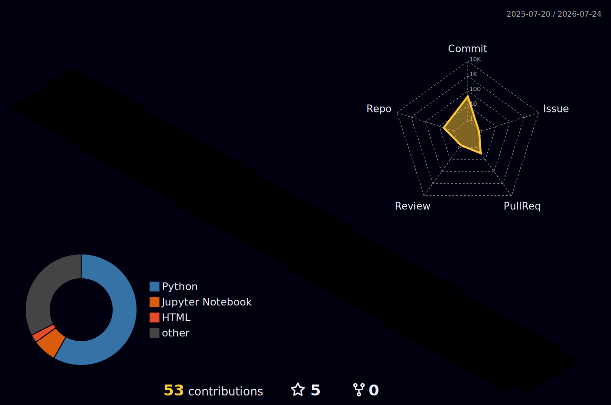

<!-- ============ ANIMATED HEADER ============ -->
<div align="center">


<!-- Animated typing intro -->
[](https://github.com/pathik1511)

[](https://pathik1511.github.io)
[](https://linkedin.com/in/patelpathik15)
[](https://www.kaggle.com/pathik1511)
[](mailto:pathikpatel660@gmail.com)
[](https://github.com/pathik1511)

</div>

---

## 👨‍💻 About Me

**Data Scientist with 5+ years** of experience driving product and business decisions through experimentation, causal inference, and statistical modeling at scale.

- 🏢 Currently **Data Scientist @ Walmart Connect** — building Brand WAMM models, NLP pipelines & causal inference frameworks
- 🎓 **M.S. Computer Science** — California State University, Long Beach (2021–2023)
- 🤖 Deep expertise in **NLP, Transformer models, MLOps** and **multi-cloud AI deployments**
- 📊 Track record: **60% ↓** tagging effort · **40% ↓** runtime · **25% ↑** marketing effectiveness
- 🏆 Active **Kaggle competitor** — sharing notebooks, datasets & competition solutions
- 📍 Farragut, Tennessee · Open to **Data Scientist** & **ML Engineer** roles

---

## 🛠 Tech Stack

**ML & AI**


**NLP & GenAI**


**Data & Cloud**


**MLOps & DevOps**


**BI & Visualisation**


---

## 📊 GitHub Stats

<div align="center">

<!-- FIX: added cache_seconds + rank_icon; removed count_private (only works on self-hosted instances and silently fails/errors on the public one) -->


<!-- FIX: streak stats moved off the dead herokuapp.com domain to the current demolab.com endpoint -->


<!-- NEW: animated contribution activity graph -->


</div>

## 🌐 3D Contribution Graph

<!-- Generated daily by .github/workflows/profile-3d-contrib.yml — see SETUP.md -->
<div align="center">
  
</div>

## 🐍 Contribution Snake

<!-- Generated by .github/workflows/snake.yml — see SETUP.md -->
<div align="center">
  <picture>
    <source media="(prefers-color-scheme: dark)" srcset="https://raw.githubusercontent.com/pathik1511/pathik1511/output/github-contribution-grid-snake-dark.svg" />
    
  </picture>
</div>

---

## 🏆 Kaggle

<div align="center">

[](https://www.kaggle.com/pathik1511)

<!-- Live tier badge (third-party service, verified working) -->
[](https://www.kaggle.com/pathik1511)

<!-- Live per-category badges — each one displays your CURRENT rank number
     (shows "Unranked" until you earn a competition ranking) plus medal counts -->
[](https://www.kaggle.com/pathik1511/competitions)
[](https://www.kaggle.com/pathik1511/datasets)
[](https://www.kaggle.com/pathik1511/code)
[](https://www.kaggle.com/pathik1511/discussion)

</div>

I'm actively competing in ML challenges and sharing reproducible work with the Kaggle community:

- 🏁 **[Competitions](https://www.kaggle.com/pathik1511/competitions)** — End-to-end ML/DL solutions with leaderboard results
- 📓 **[Notebooks](https://www.kaggle.com/pathik1511/code)** — EDA walkthroughs, feature engineering guides & model experiments
- 📦 **[Datasets](https://www.kaggle.com/pathik1511/datasets)** — Curated open datasets published for the community
- 💬 **[Discussions](https://www.kaggle.com/pathik1511/discussion)** — Tips, insights & collaboration with fellow Kagglers

> ⭐ Visit **[kaggle.com/pathik1511](https://www.kaggle.com/pathik1511)** for my latest notebooks and competition results.

---

## 🚀 Featured Projects

| Project | Description | Stack |
| --- | --- | --- |
| [☁️ ATS Resume Screener](https://github.com/pathik1511/ATS_using_google_gemini) | AI-powered Applicant Tracking System using Google Gemini for resume scoring | Python · Gemini · NLP |
| [🧠 Kidney Disease Classification](https://github.com/pathik1511/Kidney-Disease-Classification-DeepLearning-Project-MlFlow) | End-to-end deep learning pipeline with MLflow experiment tracking | PyTorch · MLflow · DVC |
| [🐔 Chicken Disease Detection](https://github.com/pathik1511/Chicken-Disease_endtoend_project) | End-to-end ML project with CI/CD pipeline and cloud deployment | Python · DVC · Docker |
| [☕ Coffee Sales Forecasting](https://github.com/pathik1511/-Coffee-Bean-Store-Sales-Prediction-and-Inventory-Optimization) | Sales prediction & inventory optimisation with ML models | Python · Scikit-learn · Pandas |
| [📝 Text-to-SQL](https://github.com/pathik1511/texttosql) | Natural language to SQL query generation using LLMs | Python · LLM · SQL |
| [🌿 Cassava Leaf Disease](https://github.com/pathik1511/Casava_Leaves) | Computer vision model for plant disease classification | TensorFlow · CNN · Kaggle |

---

## 📈 Impact Highlights

```
60% reduction in manual tagging effort   → spaCy & Hugging Face pipelines (Walmart Connect)
40% runtime reduction                    → Production WAMM framework in Python/SQL
25% boost in marketing effectiveness    → Sentiment analysis, Naïve Bayes (Syntrons)
15% creative effectiveness improvement  → NLP on customer reviews (Walmart Connect)
35% fraud detection improvement         → Deep learning fraud detection (Syntrons)
50% data processing speed increase      → PySpark big data optimisation
```

---

## 📬 Let's Connect

<div align="center">

[](https://pathik1511.github.io)
[](https://linkedin.com/in/patelpathik15)
[](https://www.kaggle.com/pathik1511)
[](mailto:pathikpatel660@gmail.com)

*Open to Data Scientist & ML Engineer roles*


</div>
